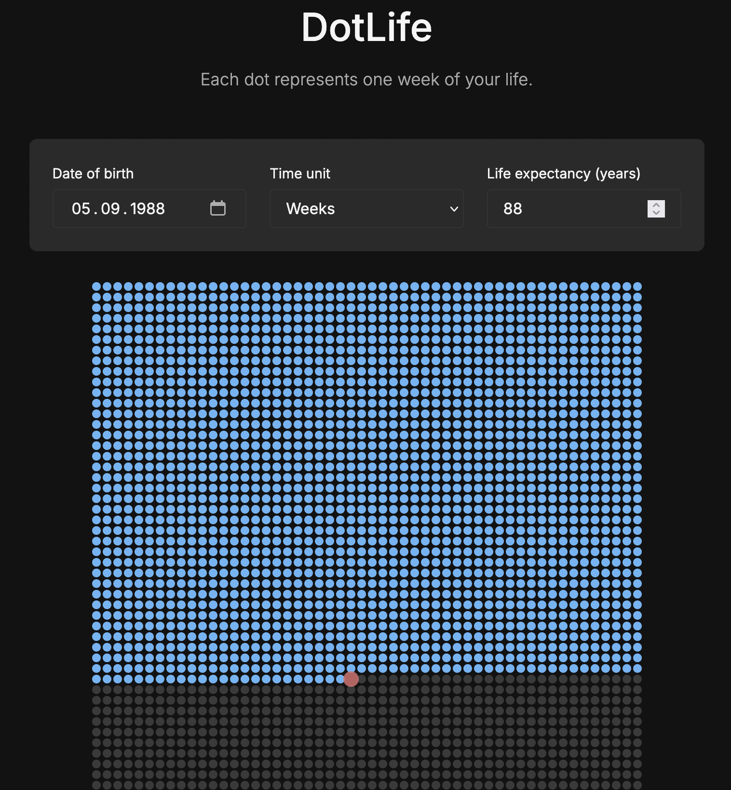

# DotLife

## Demo

Test the application here: [dotlife.nathan.swiss](https://dotlife.nathan.swiss)

## About

DotLife is a minimalist visualization of human life, represented as dots. Each dot corresponds to a unit of time (day, week, month, or year) of your life, allowing you to become aware of the time elapsed and remaining.

## Features

- **Visualization of elapsed time**: Visually display your life based on your date of birth and estimated life expectancy
- **Multiple time units**: Choose between days, weeks, months, or years
- **Real-time statistics**: View the number of units lived, remaining, and the percentage of life
- **Multi-language support**: Interface available in French, English, Spanish, Portuguese, and Italian
- **Dark/Light mode**: Adapt the interface to your visual preference
- **Responsive design**: Works on all devices, from mobile to desktop
- **No dependencies**: Lightweight application without external libraries

## Installation and Deployment

DotLife is a static web application that does not require a backend server:

1. Clone this repository: `git clone https://github.com/nthnbch/dotlife.git`
2. Open `index.html` in your browser for local testing
3. To deploy, simply copy the files to your web server or static hosting

Compatibility: All modern browsers (Chrome, Firefox, Safari, Edge)

## How to Use

1. Enter your date of birth
2. Select the desired time unit (days, weeks, months, years)
3. Adjust life expectancy if necessary (based on global statistics)
4. Visualize your life represented by dots:
   - Blue dots: elapsed time
   - Red dot: today
   - Skull dot: estimated end of life

Your preferences (language, theme) are automatically saved in your browser.

## Customization

DotLife is easy to customize:

- Modify colors in `style.css` by adjusting the CSS variables
- Add new languages by completing the dictionary in `script.js`
- Adapt the layout to your needs

## Technologies Used

- HTML5
- CSS3
- JavaScript
